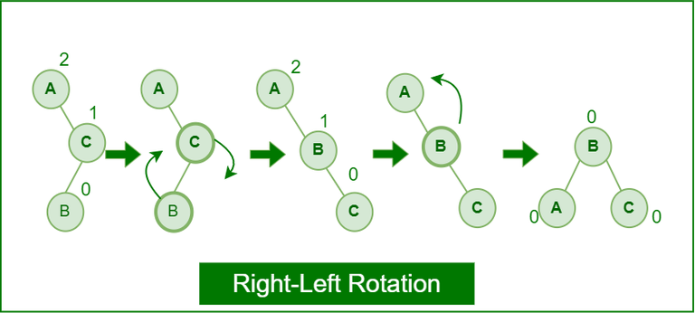

# AVL
Making an AVL tree in c++

## what is an AVL 
&nbsp;&nbsp;&nbsp;&nbsp;&nbsp;&nbsp;An AVL tree is a self balancing tree, where the difference of the right subtrees and left subtrees cannot be larger then one, this is found using the Balance factor.
### What is The balance factor ?
The balance factor is calulated by the difference in height of the two subtrees (left and right).
```
           12
          /  \
         8    18
        / \   /
       5  11 17
      /
     4
```
Here we start at the leaf nodes, 4,11 and 17. All have differences of 0, which is normal since the leaves have no children. Then let's look at their parent node. 
5 for example has a left tree of 0, since the height of 4 is 0, the right subtree is null therfore it is -1, so the balance is 1 since : ( 0 - (-1) = 1 ) and the height of 5 is 1 since : ( Height = 1 + max(0, -1) = 1 ). Now we can look at 8, which has a left subtree of height 1 ( previously calculated with 5 ) and a right subtree of 0, thus the height of 8 is 2 ( Height = 1 + max(1, 0) = 2 ), **but** it's balance is of 1 since : ( 1 - 0 = 1 ).
Now we can do the node 18, left height = 0, right height = null thus it becomes equal to -1, thus the height is 1 + max(0, -1) = 1, and the balance  0 - (-1) = 1. Finally we look at 12, it's left subtree's height is of 2 ( given by 8 ) and it's right subtree's height is 1 ( given by 18 ), **__thus__** the balance is of 2 - 1 = 1, and the height is 1 + max(2, 1) = 3.
> Thus as calculated all the nodes balance are either [-1,0,1]. Thus this is a balanced tree.

Here is some pseudocode of the recursive nature of the calculatin we just did: 
```
function isAVL(node):
    // Base case: An empty subtree is AVL and has height -1
    if node is null:
        return (true, -1)

    // Step 1: Recursively check the left subtree
    (leftIsAVL, leftHeight) = isAVL(node.left)

    // If left subtree is not AVL, no need to continue
    if not leftIsAVL:
        return (false, 0)

    // Step 2: Recursively check the right subtree
    (rightIsAVL, rightHeight) = isAVL(node.right)

    // If right subtree is not AVL, no need to continue
    if not rightIsAVL:
        return (false, 0)

    // Step 3: Check balance factor at current node
    balanceFactor = leftHeight - rightHeight

    if abs(balanceFactor) > 1:
        // Not balanced — AVL property violated
        return (false, 0)

    // Step 4: Compute the current node's height
    currentHeight = 1 + max(leftHeight, rightHeight)

    // This node is AVL, return true with its height
    return (true, currentHeight)
```
If you want to further calculate here is a non AVL tree :
```
        8
       / \
      4   15
     / \
    1   7
       /
      8
     /
    5
```

Calculate it using the previously shown steps.
## Rotations 
An AVL balances itself using what we call 'Rotations', these are a way to rearange to nodes in order to make them have all have a maximum balance factor of 1. Each are applicable in different situations. Here they are :
### Left Rotation
The left Rotation needs to happen when ...

> This is from [Geeks for Geeks](https://www.geeksforgeeks.org/introduction-to-avl-tree/)
#### Pseudocode : 
```

```
or in c++ 
```c++
    // A utility function to left rotate 
    // subtree rooted with x 
    static Node leftRotate(Node x) { 
        Node y = x.right; 
        Node T2 = y.left; 

        // Perform rotation 
        y.left = x; 
        x.right = T2; 

        // Update heights 
        x.height = 1 + Math.max(height(x.left),
                                height(x.right)); 
        y.height = 1 + Math.max(height(y.left), 
                                height(y.right)); 

        // Return new root 
        return y; 
    } 
```

### Right Rotation


> This is from [Geeks for Geeks](https://www.geeksforgeeks.org/introduction-to-avl-tree/)
#### Pseudocode : 
```
Function RightRotate(y):
    x ← y.left
    T2 ← x.right

    // Perform rotation
    x.right ← y
    y.left ← T2

    // Update heights
    y.height ← 1 + max(Height(y.left), Height(y.right))
    x.height ← 1 + max(Height(x.left), Height(x.right))

    // Return new root
    Return x
```
which is bassically the same as in c++
```c++
function rightRotate(y):
    x = y.left           // x is the left child of y
    T2 = x.right         // T2 is the right subtree of x (can be null)

    // Perform rotation
    x.right = y          // y becomes right child of x
    y.left = T2          // T2 becomes left child of y

    // Update heights (important in AVL trees)
    y.height = 1 + max(height(y.left), height(y.right))
    x.height = 1 + max(height(x.left), height(x.right))

    // Return new root of the subtree
    return x
```
### Left-Right Rotation


> This is from [Geeks for Geeks](https://www.geeksforgeeks.org/introduction-to-avl-tree/)
#### Pseudocode : 
```

```

### Right-Left Rotation


> This is from [Geeks for Geeks](https://www.geeksforgeeks.org/introduction-to-avl-tree/)
#### Pseudocode : 
```
```
